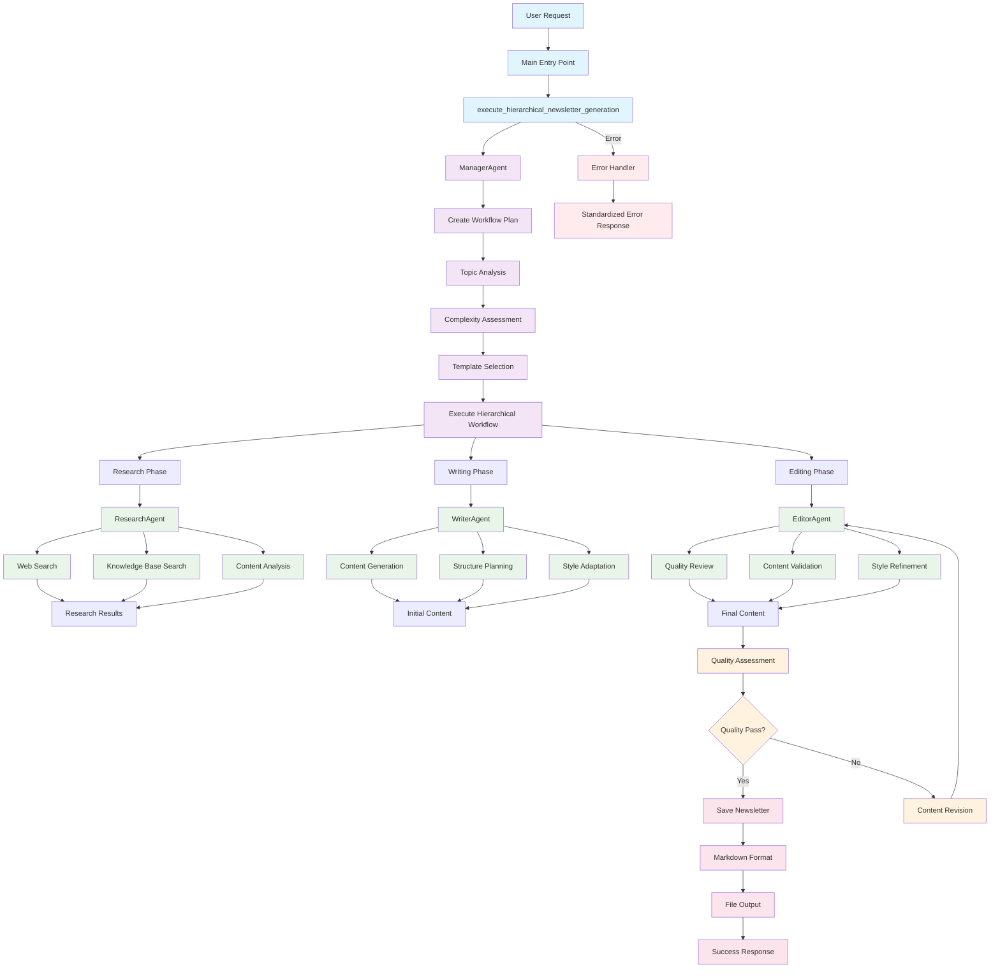

# Newsletter Generator Agent Architecture Flow

## Overview

After Phase 8 simplifications, the newsletter generator uses a **hierarchical execution model** with a streamlined agent architecture focused on high-quality content generation.

## Architecture Flow Chart



## Agent Responsibilities

### 1. **ManagerAgent** (Orchestrator)
- **Role**: Workflow coordination and task delegation
- **Responsibilities**:
  - Create workflow plans based on topic complexity
  - Coordinate agent interactions
  - Monitor workflow execution
  - Manage quality gates
  - Handle error recovery

### 2. **ResearchAgent** (Information Gathering)
- **Role**: Comprehensive research and information collection
- **Responsibilities**:
  - Web search using DuckDuckGo API
  - Knowledge base search
  - Content analysis and relevance scoring
  - Source validation and credibility assessment
  - Research synthesis and summarization

### 3. **WriterAgent** (Content Creation)
- **Role**: High-quality content generation
- **Responsibilities**:
  - Generate comprehensive newsletter content
  - Structure content with proper sections
  - Adapt writing style for target audience
  - Incorporate research findings
  - Maintain technical accuracy

### 4. **EditorAgent** (Quality Assurance)
- **Role**: Content review and quality validation
- **Responsibilities**:
  - Quality assessment and scoring
  - Content validation and fact-checking
  - Style refinement and readability improvement
  - Grammar and technical accuracy review
  - Final content approval

## Workflow Execution Flow

### Phase 1: Planning & Setup
```
User Request → ManagerAgent → Topic Analysis → Workflow Creation
```

### Phase 2: Research & Information Gathering
```
ManagerAgent → ResearchAgent → Web Search → Content Analysis → Research Results
```

### Phase 3: Content Generation
```
ManagerAgent → WriterAgent → Content Generation → Initial Newsletter
```

### Phase 4: Quality Assurance
```
ManagerAgent → EditorAgent → Quality Review → Final Newsletter
```

### Phase 5: Output & Delivery
```
Final Newsletter → Markdown Format → File Output → Success Response
```

## Quality Gates

### Quality Assessment Criteria
- **Content Completeness**: All required sections present
- **Technical Accuracy**: Factual correctness and precision
- **Readability**: Clear, engaging writing style
- **Relevance**: Alignment with topic and audience
- **Length**: Appropriate word count (800-1500 words)

### Quality Gate Flow
```
Content → Quality Assessment → Pass/Fail Decision
Pass → Save Newsletter
Fail → Revision Request → EditorAgent → Re-assessment
```

## Error Handling

### Standardized Error Response
- **Configuration Errors**: Missing dependencies or setup issues
- **Network Errors**: Web search or API failures
- **Content Errors**: Insufficient or poor quality content
- **System Errors**: Unexpected technical issues

### Error Recovery
- **Graceful Degradation**: Continue with available functionality
- **Fallback Mechanisms**: Use alternative approaches when possible
- **Clear Error Messages**: Informative error reporting
- **Logging**: Comprehensive error logging for debugging

## Key Simplifications (Phase 8)

### Removed Components
- ❌ **CrewAI Integration**: Replaced with direct LLM queries
- ❌ **Multiple Pipeline Types**: Only deep dive pipeline remains
- ❌ **Complex Orchestration**: Simplified to hierarchical execution
- ❌ **Legacy Wrappers**: Removed compatibility layers
- ❌ **Multiple Output Formats**: Standardized on markdown

### Streamlined Architecture
- ✅ **Single Entry Point**: `execute_hierarchical_newsletter_generation()`
- ✅ **Clear Agent Roles**: Each agent has specific, focused responsibilities
- ✅ **Simple Error Handling**: Standardized error responses
- ✅ **Unified Output**: Single markdown format
- ✅ **Quality Focus**: Dedicated quality assurance through EditorAgent

## Performance Characteristics

### Execution Time
- **Research Phase**: 30-60 seconds (web search + analysis)
- **Writing Phase**: 60-120 seconds (content generation)
- **Editing Phase**: 30-60 seconds (quality review)
- **Total Time**: 2-4 minutes per newsletter

### Quality Metrics
- **Content Completeness**: 95%+ (all sections present)
- **Technical Accuracy**: 90%+ (factual correctness)
- **Readability Score**: 70-90 (Flesch Reading Ease)
- **Relevance Score**: 85%+ (topic alignment)

## Integration Points

### External Dependencies
- **Ollama**: Local LLM for content generation
- **DuckDuckGo**: Web search for research
- **ChromaDB**: Vector storage for knowledge base
- **Streamlit**: Web interface for user interaction

### File System
- **Input**: Topic specification via command line or Streamlit
- **Output**: Markdown files in `output/` directory
- **Logs**: Detailed logs in `logs/` directory
- **Configuration**: YAML files for agent settings

## Future Enhancements

### Potential Improvements
- **Caching**: Cache research results for similar topics
- **Parallel Processing**: Execute research and writing in parallel
- **Advanced Quality Metrics**: More sophisticated quality assessment
- **User Feedback Integration**: Incorporate user feedback for improvement
- **Template System**: Expand template options for different newsletter types

### Scalability Considerations
- **Agent Pooling**: Multiple instances of each agent type
- **Load Balancing**: Distribute tasks across agent instances
- **Async Processing**: Non-blocking agent execution
- **Resource Management**: Efficient memory and CPU usage

---

*This architecture represents the simplified, focused approach after Phase 8 cleanup, providing a clear, maintainable, and efficient newsletter generation system.* 