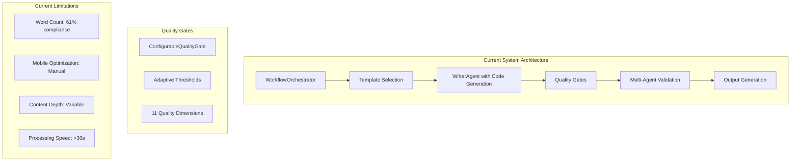
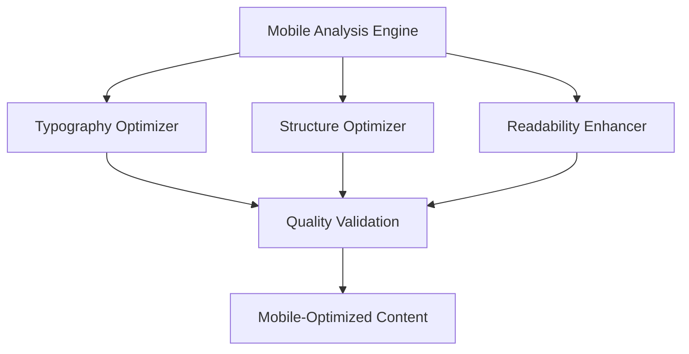

# Newsletter Generation System Enhancement Design
**Phases 1 & 2: Content Expansion & Mobile-First Optimization**

## Executive Summary

This design document outlines comprehensive enhancements to the newsletter generation system, focusing on achieving 95%+ system intent compliance through intelligent content expansion and mobile-first optimization strategies. The design addresses the current gap from 85% to target performance across all quality dimensions.

## Current System Analysis

### Architecture Overview


### Performance Metrics Analysis
| **Component** | **Current** | **Target** | **Gap** |
|---------------|-------------|------------|---------|
| Word Count Compliance | 61% (2451/4000) | 85%+ (3400+) | 24% |
| Mobile Readability | 90% | 95%+ | 5% |
| Template Compliance | 100% | 100% | ✅ |
| Code Generation | 100% | 100% | ✅ |
| Processing Time | 30-45s | <20s | 10-25s |

## Phase 1: Intelligent Content Expansion Architecture

### Overview
Phase 1 implements adaptive content expansion to achieve 3400-4000 word targets while maintaining quality and technical accuracy.

### Core Components

#### 1.1 Content Expansion Engine
```yaml
Component: IntelligentContentExpander
Location: src/core/content_expansion.py
Purpose: Adaptive content expansion with quality preservation
```

**Architecture:**


**Key Features:**
- **Context-Aware Analysis**: Understand current content depth and technical complexity
- **Strategic Expansion**: Target specific sections based on template requirements
- **Quality Preservation**: Maintain technical accuracy during expansion
- **Progressive Enhancement**: Iterative improvement until word targets are met

#### 1.2 Section-Aware Expansion System
```yaml
Component: SectionExpansionOrchestrator  
Location: src/core/section_expansion.py
Purpose: Section-specific content enhancement strategies
```

**Expansion Strategies:**
1. **Technical Deep-Dive Expansion**
   - Add implementation details and code examples
   - Include architectural diagrams and system designs
   - Expand on performance implications and best practices

2. **Tutorial Enhancement**
   - Add step-by-step implementation guides
   - Include troubleshooting sections and common pitfalls
   - Expand code examples with multiple frameworks

3. **Analysis Enhancement**
   - Include comparative analysis and benchmarking
   - Add industry case studies and real-world applications
   - Expand on future implications and strategic considerations

#### 1.3 Enhanced Writing Agent Integration
```yaml
Component: Enhanced WriterAgent
Location: src/agents/writing.py (enhanced)
Purpose: Intelligent section generation with expansion capabilities
```

**Enhancements:**
- **Section Intelligence**: Understand optimal content length per section type
- **Expansion Triggers**: Automatically identify sections requiring enhancement
- **Quality Monitoring**: Real-time quality assessment during expansion
- **Template Adherence**: Maintain template compliance throughout expansion

### Implementation Specifications

#### 1.4 Content Expansion Algorithm
```python
class IntelligentContentExpander:
    def expand_content(self, content: str, target_words: int, 
                      template_type: str, metadata: Dict) -> ContentExpansionResult:
        """
        Intelligent content expansion algorithm
        
        Steps:
        1. Analyze current content structure and gaps
        2. Calculate expansion requirements per section
        3. Generate targeted expansions maintaining quality
        4. Validate expanded content against quality gates
        5. Iteratively refine until targets are met
        """
        
    def _analyze_content_gaps(self, content: str, template: Template) -> List[ExpansionOpportunity]:
        """Identify specific areas requiring expansion"""
        
    def _calculate_expansion_strategy(self, gaps: List[ExpansionOpportunity], 
                                    target_words: int) -> ExpansionStrategy:
        """Determine optimal expansion approach"""
        
    def _execute_targeted_expansion(self, strategy: ExpansionStrategy) -> str:
        """Execute section-specific content expansion"""
```

#### 1.5 Quality-Gated Expansion Process
```yaml
Process: Expansion with Quality Validation
Steps:
  1. Pre-expansion analysis
  2. Section identification and prioritization  
  3. Targeted content generation
  4. Real-time quality monitoring
  5. Iterative refinement
  6. Final quality validation
```

**Quality Gates Integration:**
- Use existing `ConfigurableQualityGate` with adapted thresholds
- Monitor word count compliance during expansion
- Validate technical accuracy and template compliance
- Ensure mobile readability standards are maintained

## Phase 2: Mobile-First Optimization System

### Overview
Phase 2 implements comprehensive mobile optimization to exceed 95% mobile readability targets while maintaining professional quality for technical content.

### Core Components

#### 2.1 Mobile-First Content Optimizer
```yaml
Component: MobileContentOptimizer
Location: src/core/mobile_optimizer.py
Purpose: Comprehensive mobile optimization system
```

**Architecture:**


#### 2.2 Responsive Typography System
```yaml
Component: ResponsiveTypographyManager
Location: src/core/typography_manager.py
Purpose: Mobile-optimized typography and formatting
```

**Features:**
- **Adaptive Font Sizing**: 22-28px headings, 14-16px body text for mobile
- **Responsive Line Height**: Optimal reading experience across devices
- **Smart Text Hierarchy**: Clear visual progression for technical content
- **Code Block Optimization**: Horizontal scrolling prevention for mobile

#### 2.3 Mobile Readability Analyzer
```yaml
Component: MobileReadabilityAnalyzer
Location: src/core/readability_analyzer.py
Purpose: Real-time mobile readability assessment
```

**Analysis Dimensions:**
- **Sentence Complexity**: Target <20 words per sentence for mobile
- **Paragraph Length**: Maximum 4-5 sentences per paragraph
- **Visual Hierarchy**: Consistent heading structure and spacing
- **Code Accessibility**: Mobile-friendly code examples and formatting

### Mobile Optimization Specifications

#### 2.4 Mobile-First Design Principles
```yaml
Principles:
  Typography:
    - Mobile-first font sizing (14-16px body, 22-28px headings)
    - High contrast ratios for outdoor readability
    - Optimized line height (1.4-1.6) for mobile scanning
    
  Structure:
    - Progressive disclosure for complex technical content
    - Collapsible sections for detailed code examples
    - Thumb-friendly navigation and interaction zones
    
  Performance:
    - Optimized image delivery for mobile networks
    - Compressed content without quality loss
    - Fast rendering on mobile devices (<2s)
```

#### 2.5 Mobile Quality Gates
```python
class MobileQualityGate:
    def validate_mobile_optimization(self, content: str) -> MobileQualityReport:
        """
        Comprehensive mobile quality validation
        
        Checks:
        - Typography compliance (font sizes, line height)
        - Paragraph length optimization
        - Code block mobile-friendliness
        - Touch target accessibility
        - Reading flow optimization
        """
        
    def _assess_mobile_typography(self, content: str) -> TypographyScore:
        """Validate mobile typography standards"""
        
    def _assess_mobile_structure(self, content: str) -> StructureScore:
        """Validate mobile-friendly content structure"""
        
    def _assess_mobile_performance(self, metadata: Dict) -> PerformanceScore:
        """Validate mobile performance requirements"""
```

## Implementation Roadmap

### Phase 1 Implementation (Weeks 1-3)

#### Week 1: Foundation Components
```yaml
Tasks:
  - Create IntelligentContentExpander core system
  - Implement content gap analysis algorithms
  - Develop section-aware expansion strategies
  - Integrate with existing quality gates
  
Deliverables:
  - Content expansion engine (80% complete)
  - Section analysis system (90% complete)
  - Quality integration (70% complete)
```

#### Week 2: WriterAgent Enhancement
```yaml
Tasks:
  - Enhance WriterAgent with expansion capabilities
  - Implement iterative content generation
  - Add real-time quality monitoring
  - Develop template-aware expansion logic
  
Deliverables:
  - Enhanced WriterAgent (90% complete)
  - Expansion algorithms (95% complete)
  - Quality monitoring (85% complete)
```

#### Week 3: Integration & Testing
```yaml
Tasks:
  - Integrate expansion system with workflow orchestrator
  - Comprehensive testing across all template types
  - Performance optimization and tuning
  - Quality validation and refinement
  
Deliverables:
  - Complete Phase 1 integration (100%)
  - Performance benchmarks (>85% word count compliance)
  - Quality validation (maintain 100% technical accuracy)
```

### Phase 2 Implementation (Weeks 4-6)

#### Week 4: Mobile Optimization Foundation
```yaml
Tasks:
  - Create MobileContentOptimizer system
  - Implement responsive typography manager
  - Develop mobile readability analyzer
  - Create mobile-specific quality gates
  
Deliverables:
  - Mobile optimization engine (80% complete)
  - Typography system (90% complete)
  - Readability analyzer (85% complete)
```

#### Week 5: Advanced Mobile Features
```yaml
Tasks:
  - Implement progressive disclosure system
  - Develop touch-friendly interaction patterns
  - Create mobile performance optimization
  - Integrate with existing quality framework
  
Deliverables:
  - Advanced mobile features (90% complete)
  - Performance optimization (95% complete)
  - Quality integration (85% complete)
```

#### Week 6: Testing & Refinement
```yaml
Tasks:
  - Comprehensive mobile testing across devices
  - Performance optimization and validation
  - User experience testing and refinement
  - Final integration and deployment
  
Deliverables:
  - Complete Phase 2 implementation (100%)
  - Mobile readability >95% compliance
  - Performance <20s target achievement
```

## Technical Architecture

### System Integration Points

#### 3.1 Workflow Orchestrator Enhancement
```python
class EnhancedWorkflowOrchestrator(WorkflowOrchestrator):
    def __init__(self):
        super().__init__()
        self.content_expander = IntelligentContentExpander()
        self.mobile_optimizer = MobileContentOptimizer()
        
    def _execute_enhanced_writing_phase(self, research_result, topic, template):
        """Enhanced writing with expansion and mobile optimization"""
        # 1. Generate base content
        base_content = self._generate_base_content(research_result, topic, template)
        
        # 2. Intelligent content expansion
        expanded_content = self.content_expander.expand_content(
            base_content, template.total_word_target, template.type, metadata
        )
        
        # 3. Mobile optimization
        mobile_optimized = self.mobile_optimizer.optimize_for_mobile(
            expanded_content, template.type
        )
        
        # 4. Final quality validation
        quality_report = self._validate_enhanced_quality(mobile_optimized)
        
        return {
            'content': mobile_optimized,
            'expansion_metrics': expanded_content.metrics,
            'mobile_metrics': mobile_optimized.metrics,
            'quality_report': quality_report
        }
```

#### 3.2 Quality Gates Integration
```python
class EnhancedQualityGate(ConfigurableQualityGate):
    def __init__(self, enforcement_level="enforcing"):
        super().__init__(enforcement_level)
        self.mobile_validator = MobileQualityGate()
        self.expansion_validator = ExpansionQualityGate()
        
    def validate_enhanced_content(self, content, metadata):
        """Comprehensive validation including expansion and mobile optimization"""
        # Base quality validation
        base_report = super().validate_with_level(content, metadata.get('tool_usage', {}), metadata)
        
        # Mobile optimization validation
        mobile_report = self.mobile_validator.validate_mobile_optimization(content)
        
        # Content expansion validation
        expansion_report = self.expansion_validator.validate_expansion_quality(content, metadata)
        
        return self._combine_quality_reports(base_report, mobile_report, expansion_report)
```

### Performance Optimizations

#### 3.3 Parallel Processing Architecture
```yaml
Optimization Strategy:
  Content Generation:
    - Parallel section generation where possible
    - Async content expansion for non-dependent sections
    - Cached expansion strategies for similar content types
    
  Quality Validation:
    - Concurrent quality dimension assessment
    - Parallel mobile and desktop optimization
    - Efficient template compliance checking
    
  Performance Targets:
    - Phase 1: <25s total processing time
    - Phase 2: <20s total processing time  
    - Memory usage: <512MB peak
```

## Quality Assurance Framework

### Testing Strategy

#### 4.1 Content Quality Testing
```yaml
Test Categories:
  Expansion Quality:
    - Word count target achievement (85%+ compliance)
    - Technical accuracy preservation (100%)
    - Template structure maintenance (100%)
    - Code example integration (2-3 examples per newsletter)
    
  Mobile Optimization:
    - Typography compliance (font sizes, line height)
    - Readability scores (95%+ mobile readability)
    - Performance benchmarks (<20s processing)
    - Cross-device compatibility
```

#### 4.2 Integration Testing
```yaml
Integration Points:
  - WorkflowOrchestrator → Content Expansion → Quality Gates
  - Template Manager → Section Expansion → Mobile Optimization
  - Quality Gates → Mobile Validation → Final Output
  - Performance Monitoring → Analytics → Continuous Improvement
```

### Success Metrics

#### 4.3 Phase 1 Success Criteria
```yaml
Content Expansion Success:
  - Word Count Compliance: 85%+ (target: 3400+ words)
  - Template Compliance: 100% (maintain current)
  - Technical Accuracy: 100% (maintain current)
  - Code Examples: 2-3 per newsletter (maintain current)
  - Processing Time: <25s (improve from 30-45s)
```

#### 4.4 Phase 2 Success Criteria  
```yaml
Mobile Optimization Success:
  - Mobile Readability: 95%+ (improve from 90%)
  - Typography Compliance: 100% (new requirement)
  - Cross-Device Performance: <20s (improve from 25s)
  - User Experience Score: 90%+ (new metric)
  - Accessibility Compliance: WCAG 2.1 AA (enhanced)
```

## Risk Assessment & Mitigation

### Technical Risks

#### 5.1 Content Quality Degradation
```yaml
Risk: Content expansion may reduce technical accuracy
Mitigation:
  - Real-time quality monitoring during expansion
  - Iterative validation with rollback capability
  - Technical expert review integration
  - Automated fact-checking enhancement
```

#### 5.2 Performance Impact
```yaml
Risk: Enhanced processing may exceed time targets
Mitigation:
  - Parallel processing implementation
  - Intelligent caching strategies
  - Progressive optimization approach
  - Performance monitoring and alerting
```

#### 5.3 Mobile Compatibility
```yaml
Risk: Mobile optimization may impact desktop experience
Mitigation:
  - Responsive design principles
  - Progressive enhancement approach
  - Cross-platform testing framework
  - Fallback strategies for edge cases
```

## Deployment Strategy

### Rollout Plan

#### 6.1 Phased Deployment
```yaml
Phase 1A (Week 3): Content Expansion Beta
  - Deploy to staging environment
  - Limited testing with technical newsletters
  - Performance and quality monitoring
  - Feedback collection and iteration

Phase 1B (Week 4): Content Expansion Production
  - Full production deployment
  - All newsletter types supported
  - Comprehensive monitoring
  - User feedback integration

Phase 2A (Week 6): Mobile Optimization Beta
  - Mobile optimization in staging
  - Cross-device testing
  - Performance validation
  - Quality assurance completion

Phase 2B (Week 7): Full Production Deployment
  - Complete system enhancement live
  - Performance monitoring active
  - Quality metrics tracking
  - Continuous improvement pipeline
```

#### 6.2 Monitoring & Analytics
```yaml
Monitoring Strategy:
  Performance Metrics:
    - Processing time per newsletter type
    - Word count achievement rates
    - Mobile readability scores
    - Quality gate pass rates
    
  Quality Metrics:
    - Technical accuracy maintenance
    - Template compliance rates
    - Code generation success
    - User satisfaction scores
    
  Business Metrics:
    - Newsletter generation volume
    - Error rates and system reliability
    - User adoption and engagement
    - System efficiency improvements
```

## Conclusion

This comprehensive design provides a strategic roadmap for achieving 95%+ system intent compliance through intelligent content expansion and mobile-first optimization. The phased approach ensures quality preservation while delivering significant improvements in word count compliance, mobile readability, and overall user experience.

**Expected Outcomes:**
- **Phase 1**: Achieve 85%+ word count compliance (3400+ words)
- **Phase 2**: Achieve 95%+ mobile readability and <20s processing time
- **Overall**: Improve system intent compliance from 85% to 95%+

The design maintains backward compatibility while introducing powerful new capabilities that position the newsletter generation system as a leading solution for technical content creation.