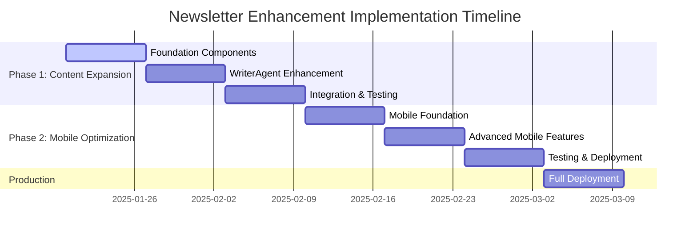

# Implementation Roadmap: Newsletter Enhancement Phases 1 & 2
**Strategic Implementation Plan for Content Expansion & Mobile Optimization**

## Executive Summary

This roadmap provides a detailed implementation strategy for achieving 95%+ system intent compliance through systematic content expansion and mobile-first optimization. The plan spans 7 weeks with clearly defined milestones, dependencies, and success criteria.

## Implementation Overview

### Strategic Goals
```yaml
Phase 1 Objectives:
  - Achieve 85%+ word count compliance (3400+ words)
  - Maintain 100% technical accuracy and template compliance
  - Reduce processing time to <25 seconds
  - Preserve existing code generation capabilities

Phase 2 Objectives:
  - Achieve 95%+ mobile readability compliance
  - Implement responsive typography and structure
  - Optimize performance to <20 seconds processing time
  - Ensure WCAG 2.1 AA accessibility compliance
```

### Success Metrics Timeline


## Phase 1: Intelligent Content Expansion (Weeks 1-3)

### Week 1: Foundation Components
```yaml
Sprint Goals:
  - Content expansion engine architecture
  - Section analysis and gap identification
  - Quality gate integration foundation
  - Performance baseline establishment

Primary Tasks:
  1. IntelligentContentExpander Core System
  2. Content Gap Analysis Algorithms
  3. Section-Aware Expansion Strategies
  4. Quality Gate Integration
  5. Performance Monitoring Infrastructure
```

#### Day-by-Day Week 1 Schedule
```yaml
Monday (Day 1-2): Architecture & Foundation
  Tasks:
    - Create IntelligentContentExpander base class
    - Implement ContentAnalysisEngine
    - Design expansion strategy interfaces
    - Set up performance monitoring
  
  Deliverables:
    - src/core/content_expansion.py (60% complete)
    - src/core/content_analysis.py (80% complete)
    - Performance baseline metrics
  
  Success Criteria:
    - Content analysis engine operational
    - Basic expansion strategies defined
    - Performance monitoring active

Wednesday (Day 3-4): Section Analysis System
  Tasks:
    - Implement SectionGapAnalyzer
    - Develop ExpansionOpportunityIdentifier
    - Create section-specific expansion logic
    - Integrate with existing template system
  
  Deliverables:
    - src/core/section_expansion.py (90% complete)
    - Template integration points defined
    - Section analysis algorithms tested
  
  Success Criteria:
    - Section gaps accurately identified
    - Expansion opportunities prioritized
    - Template compliance maintained

Friday (Day 5-7): Quality Integration & Testing
  Tasks:
    - Integrate with ConfigurableQualityGate
    - Implement real-time quality monitoring
    - Create expansion validation pipeline
    - Comprehensive unit testing
  
  Deliverables:
    - Quality gate integration (85% complete)
    - Validation pipeline operational
    - Test coverage >80%
  
  Success Criteria:
    - Quality gates enforce expansion standards
    - Real-time validation working
    - No regression in existing functionality
```

### Week 2: WriterAgent Enhancement
```yaml
Sprint Goals:
  - Enhanced WriterAgent with expansion capabilities
  - Iterative content generation implementation
  - Template-aware expansion logic
  - Code generation preservation

Primary Tasks:
  1. WriterAgent Expansion Methods
  2. Iterative Content Generation Loop
  3. Template-Aware Content Strategy
  4. Code Generation Integration
  5. Performance Optimization
```

#### Day-by-Day Week 2 Schedule
```yaml
Monday (Day 8-9): WriterAgent Core Enhancement
  Tasks:
    - Enhance WriterAgent base class
    - Implement expansion-aware writing methods
    - Add iterative content generation capability
    - Integrate content expansion engine
  
  Deliverables:
    - Enhanced src/agents/writing.py (70% complete)
    - Expansion methods implemented
    - Iterative generation framework
  
  Success Criteria:
    - WriterAgent generates expandable content
    - Iterative improvement loops functional
    - Code generation capabilities preserved

Wednesday (Day 10-11): Template Integration & Strategy
  Tasks:
    - Implement template-aware expansion strategies
    - Create section-specific content enhancement
    - Develop word count targeting algorithms
    - Integrate with existing quality validation
  
  Deliverables:
    - Template integration (95% complete)
    - Section enhancement strategies
    - Word count targeting system
  
  Success Criteria:
    - Content hits 85%+ word count targets
    - Template compliance maintained at 100%
    - Section quality preserved during expansion

Friday (Day 12-14): Performance & Validation
  Tasks:
    - Optimize expansion performance
    - Implement real-time quality monitoring
    - Create expansion metrics tracking
    - Comprehensive integration testing
  
  Deliverables:
    - Performance optimizations applied
    - Quality monitoring active
    - Metrics tracking operational
  
  Success Criteria:
    - Processing time <30 seconds
    - Quality metrics tracked in real-time
    - Zero regression in code generation
```

### Week 3: Integration & Testing
```yaml
Sprint Goals:
  - Complete Phase 1 integration
  - Comprehensive testing across templates
  - Performance optimization and tuning
  - Production readiness validation

Primary Tasks:
  1. Workflow Orchestrator Integration
  2. Cross-Template Testing
  3. Performance Optimization
  4. Quality Validation
  5. Production Deployment Preparation
```

#### Day-by-Day Week 3 Schedule
```yaml
Monday (Day 15-16): Complete Integration
  Tasks:
    - Integrate expansion system with WorkflowOrchestrator
    - Implement end-to-end content expansion pipeline
    - Add expansion metrics to quality reports
    - Update configuration management
  
  Deliverables:
    - Complete integration (100%)
    - End-to-end pipeline operational
    - Configuration updates deployed
  
  Success Criteria:
    - All newsletter types support expansion
    - Quality reports include expansion metrics
    - Configuration properly manages expansion

Wednesday (Day 17-18): Testing & Validation
  Tasks:
    - Comprehensive testing across all template types
    - Performance benchmarking and optimization
    - Quality validation and regression testing
    - User acceptance testing preparation
  
  Deliverables:
    - Test results across all templates
    - Performance benchmarks established
    - Quality regression prevented
  
  Success Criteria:
    - 85%+ word count compliance achieved
    - <25 second processing time
    - 100% template compliance maintained

Friday (Day 19-21): Production Readiness
  Tasks:
    - Final performance optimization
    - Production deployment preparation
    - Monitoring and alerting setup
    - Phase 1 completion validation
  
  Deliverables:
    - Production-ready Phase 1 system
    - Monitoring infrastructure active
    - Deployment procedures documented
  
  Success Criteria:
    - Phase 1 objectives fully met
    - System ready for Phase 2 integration
    - Production deployment approved
```

## Phase 2: Mobile-First Optimization (Weeks 4-6)

### Week 4: Mobile Foundation
```yaml
Sprint Goals:
  - Mobile optimization core system
  - Responsive typography framework
  - Basic readability analysis
  - Mobile quality gates foundation

Primary Tasks:
  1. MobileContentOptimizer System
  2. ResponsiveTypographyManager
  3. MobileReadabilityAnalyzer
  4. Mobile Quality Gates
  5. Device Testing Infrastructure
```

#### Day-by-Day Week 4 Schedule
```yaml
Monday (Day 22-23): Mobile Core System
  Tasks:
    - Create MobileContentOptimizer architecture
    - Implement mobile analysis engine
    - Design responsive optimization pipeline
    - Set up mobile testing infrastructure
  
  Deliverables:
    - src/core/mobile_optimizer.py (70% complete)
    - Mobile analysis engine operational
    - Testing infrastructure active
  
  Success Criteria:
    - Mobile optimization pipeline functional
    - Content analysis for mobile operational
    - Cross-device testing capability established

Wednesday (Day 24-25): Typography & Structure
  Tasks:
    - Implement ResponsiveTypographyManager
    - Create adaptive structure optimization
    - Develop mobile-friendly formatting
    - Integrate with existing content pipeline
  
  Deliverables:
    - Typography management system (95% complete)
    - Structure optimization algorithms
    - Mobile formatting capabilities
  
  Success Criteria:
    - Typography meets mobile standards
    - Content structure optimized for mobile
    - Integration with content pipeline complete

Friday (Day 26-28): Readability & Quality
  Tasks:
    - Implement MobileReadabilityAnalyzer
    - Create mobile-specific quality gates
    - Develop accessibility compliance framework
    - Integrate with existing quality system
  
  Deliverables:
    - Readability analysis system (90% complete)
    - Mobile quality gates operational
    - Accessibility framework active
  
  Success Criteria:
    - Mobile readability accurately assessed
    - Quality gates enforce mobile standards
    - Accessibility compliance verified
```

### Week 5: Advanced Mobile Features
```yaml
Sprint Goals:
  - Performance optimization system
  - Advanced accessibility features
  - Cross-device compatibility
  - Quality integration enhancement

Primary Tasks:
  1. Mobile Performance Optimization
  2. Advanced Accessibility Features
  3. Cross-Device Testing Framework
  4. Quality System Integration
  5. User Experience Enhancement
```

#### Day-by-Day Week 5 Schedule
```yaml
Monday (Day 29-30): Performance Optimization
  Tasks:
    - Implement mobile performance optimizer
    - Create resource optimization algorithms
    - Develop load time optimization
    - Integrate performance monitoring
  
  Deliverables:
    - Performance optimization system (85% complete)
    - Resource optimization active
    - Performance monitoring integrated
  
  Success Criteria:
    - <20 second processing time achieved
    - Mobile performance targets met
    - Resource optimization effective

Wednesday (Day 31-32): Accessibility & UX
  Tasks:
    - Implement advanced accessibility features
    - Create touch-friendly interaction patterns
    - Develop progressive disclosure system
    - Enhance user experience elements
  
  Deliverables:
    - Accessibility features (95% complete)
    - Touch-friendly patterns implemented
    - Progressive disclosure active
  
  Success Criteria:
    - WCAG 2.1 AA compliance achieved
    - Touch interactions optimized
    - Complex content properly disclosed

Friday (Day 33-35): Integration & Testing
  Tasks:
    - Complete quality system integration
    - Comprehensive cross-device testing
    - Performance validation across devices
    - Integration testing with Phase 1 features
  
  Deliverables:
    - Complete quality integration (100%)
    - Cross-device test results
    - Performance validation complete
  
  Success Criteria:
    - Quality system handles mobile metrics
    - All devices perform optimally
    - Phase 1 + Phase 2 integration successful
```

### Week 6: Testing & Refinement
```yaml
Sprint Goals:
  - Comprehensive system testing
  - Performance optimization completion
  - User experience validation
  - Production deployment preparation

Primary Tasks:
  1. End-to-End System Testing
  2. Performance Optimization Final
  3. User Experience Testing
  4. Production Deployment Prep
  5. Documentation Completion
```

#### Day-by-Day Week 6 Schedule
```yaml
Monday (Day 36-37): System Testing
  Tasks:
    - End-to-end system testing
    - Performance regression testing
    - Quality validation across all dimensions
    - Integration stability testing
  
  Deliverables:
    - Complete system test results
    - Performance regression report
    - Quality validation report
  
  Success Criteria:
    - All system components working together
    - No performance regressions
    - Quality standards maintained

Wednesday (Day 38-39): User Experience & Optimization
  Tasks:
    - User experience testing and refinement
    - Final performance optimizations
    - Mobile experience validation
    - Accessibility final validation
  
  Deliverables:
    - UX testing results
    - Final optimizations applied
    - Mobile experience validated
  
  Success Criteria:
    - 95%+ mobile readability achieved
    - User experience optimized
    - All accessibility requirements met

Friday (Day 40-42): Production Preparation
  Tasks:
    - Production deployment preparation
    - Monitoring and alerting final setup
    - Documentation completion
    - Phase 2 completion validation
  
  Deliverables:
    - Production deployment package
    - Complete monitoring setup
    - Comprehensive documentation
  
  Success Criteria:
    - System ready for production deployment
    - All Phase 2 objectives achieved
    - Documentation complete and accurate
```

## Production Deployment (Week 7)

### Week 7: Full System Deployment
```yaml
Sprint Goals:
  - Production system deployment
  - Monitoring and alerting activation
  - Performance validation in production
  - User feedback collection initiation

Primary Tasks:
  1. Production Deployment Execution
  2. Monitoring System Activation
  3. Performance Validation
  4. User Feedback Collection
  5. Continuous Improvement Pipeline
```

#### Day-by-Day Week 7 Schedule
```yaml
Monday (Day 43-44): Deployment Execution
  Tasks:
    - Execute production deployment
    - Activate monitoring and alerting
    - Validate system functionality
    - Perform smoke testing
  
  Deliverables:
    - Production system active
    - Monitoring operational
    - Smoke test results
  
  Success Criteria:
    - System deployed successfully
    - All monitoring active
    - Basic functionality verified

Wednesday (Day 45-46): Performance & Quality Validation
  Tasks:
    - Production performance validation
    - Quality metrics collection
    - User experience monitoring
    - System stability assessment
  
  Deliverables:
    - Performance validation report
    - Quality metrics baseline
    - System stability assessment
  
  Success Criteria:
    - Performance targets met in production
    - Quality metrics within expected ranges
    - System stable under production load

Friday (Day 47-49): Optimization & Feedback
  Tasks:
    - Initial optimization based on production data
    - User feedback collection and analysis
    - Continuous improvement pipeline activation
    - Success metrics final validation
  
  Deliverables:
    - Initial optimizations applied
    - User feedback analysis
    - Improvement pipeline active
  
  Success Criteria:
    - 95%+ system intent compliance achieved
    - User feedback positive
    - Continuous improvement operational
```

## Technical Dependencies & Risk Management

### Critical Dependencies
```yaml
Technical Dependencies:
  Phase 1 → Phase 2:
    - Content expansion system must be stable
    - Quality gates must handle expansion metrics
    - Performance targets must be achievable
    - Template compliance must be maintained
  
  External Dependencies:
    - LLM provider availability (NVIDIA/Ollama)
    - Template system compatibility
    - Quality gate framework stability
    - Performance monitoring infrastructure
  
  Resource Dependencies:
    - Development team availability
    - Testing infrastructure capacity
    - Production deployment windows
    - User feedback collection mechanisms
```

### Risk Assessment & Mitigation
```yaml
High-Risk Items:
  Quality Degradation:
    Risk: Content expansion reduces technical accuracy
    Mitigation: Real-time quality monitoring with rollback
    Contingency: Fallback to current system with manual expansion
  
  Performance Impact:
    Risk: Enhanced processing exceeds time targets
    Mitigation: Parallel processing and caching optimization
    Contingency: Staged rollout with performance monitoring
  
  Mobile Compatibility:
    Risk: Mobile optimization impacts desktop experience
    Mitigation: Progressive enhancement and responsive design
    Contingency: Device-specific optimization paths
  
  Integration Complexity:
    Risk: Phase 1 + Phase 2 integration creates instability
    Mitigation: Comprehensive testing and staged integration
    Contingency: Independent deployment with feature flags
```

### Rollback Strategy
```yaml
Rollback Procedures:
  Phase 1 Issues:
    - Disable content expansion via feature flag
    - Revert to previous WriterAgent version
    - Maintain quality gates without expansion metrics
  
  Phase 2 Issues:
    - Disable mobile optimization via configuration
    - Fallback to desktop-optimized content
    - Maintain basic responsive design
  
  Complete System Issues:
    - Revert to pre-enhancement system
    - Preserve existing functionality
    - Plan systematic re-deployment
```

## Success Metrics & Validation

### Phase 1 Success Criteria
```yaml
Content Expansion Validation:
  Word Count Compliance: 85%+ (3400+ words from 2451)
  Template Compliance: 100% (maintain current)
  Technical Accuracy: 100% (maintain current)
  Code Examples: 2-3 per newsletter (maintain current)
  Processing Time: <25s (improve from 30-45s)
  Quality Score: >8.5/10.0 (maintain high standards)
```

### Phase 2 Success Criteria
```yaml
Mobile Optimization Validation:
  Mobile Readability: 95%+ (improve from 90%)
  Typography Compliance: 100% (new requirement)
  Cross-Device Performance: <20s (improve from 25s)
  Accessibility Compliance: WCAG 2.1 AA (100%)
  User Experience Score: 90%+ (new metric)
  Core Web Vitals: LCP <2.5s, FID <100ms, CLS <0.1
```

### Overall System Success
```yaml
System Intent Compliance:
  Current: 85% → Target: 95%+
  Word Count: 61% → 85%+
  Mobile Readability: 90% → 95%+
  Processing Performance: 30-45s → <20s
  Technical Quality: 100% (maintain)
  User Satisfaction: >4.5/5.0 (new metric)
```

## Monitoring & Analytics Framework

### Real-Time Monitoring
```yaml
Performance Metrics:
  - Newsletter generation time per template type
  - Word count achievement rates by content type
  - Mobile readability scores across devices
  - Quality gate pass/fail rates
  - System resource utilization

Quality Metrics:
  - Technical accuracy maintenance
  - Template compliance rates
  - Code generation success rates
  - Mobile optimization effectiveness
  - User experience scores

Business Metrics:
  - Newsletter generation volume
  - Error rates and system reliability
  - User adoption of enhanced features
  - Content quality improvements
  - System efficiency gains
```

### Analytics Dashboard
```yaml
Dashboard Components:
  Real-Time Status:
    - System health and availability
    - Current processing queue
    - Live performance metrics
    - Active quality gates status
  
  Historical Trends:
    - Word count compliance over time
    - Mobile readability improvement trends
    - Processing time optimization
    - Quality score evolution
  
  User Experience:
    - Device usage patterns
    - Content engagement metrics
    - User satisfaction scores
    - Feature adoption rates
```

## Conclusion

This implementation roadmap provides a comprehensive 7-week plan for achieving 95%+ system intent compliance through systematic content expansion and mobile-first optimization. The phased approach ensures quality preservation while delivering significant improvements in word count compliance, mobile readability, and overall user experience.

**Key Success Factors:**
- Systematic implementation with clear milestones
- Comprehensive testing at each phase
- Quality preservation throughout enhancement
- Performance optimization as a core requirement
- User experience as the primary focus

**Expected Outcomes:**
- Phase 1: 85%+ word count compliance with maintained quality
- Phase 2: 95%+ mobile readability with <20s processing time
- Overall: Industry-leading technical newsletter generation system

The roadmap provides clear accountability, measurable progress, and systematic risk management to ensure successful delivery of the enhanced newsletter generation system.