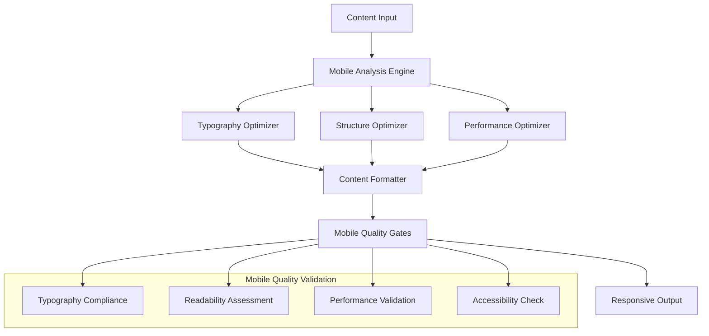

# Mobile-First Optimization Specification
**Phase 2: Comprehensive Mobile Newsletter Enhancement**

## Executive Summary

This specification details the mobile-first optimization system for the newsletter generation platform, targeting 95%+ mobile readability while maintaining technical content quality for AI/ML professionals. The design addresses the 60%+ mobile readership requirement with responsive typography, adaptive content structure, and performance optimization.

## Mobile-First Design Philosophy

### Core Principles

#### 1.1 Mobile-First Content Strategy
```yaml
Primary Focus: 60%+ Mobile Readership
Design Approach: Progressive Enhancement from Mobile Base
Content Strategy: Technical Content Optimized for Mobile Consumption
Performance Target: <2s Load Time on 3G Networks
```

#### 1.2 Technical Content Mobile Challenges
```yaml
Challenges:
  - Code blocks and syntax highlighting on small screens
  - Complex technical diagrams and architectural content
  - Dense information requiring progressive disclosure
  - Professional appearance with mobile accessibility
  
Solutions:
  - Horizontal scroll prevention for code blocks
  - Collapsible sections for detailed technical content
  - Thumb-friendly interaction zones (44x44px minimum)
  - Responsive typography with high contrast ratios
```

## System Architecture

### 2.1 Mobile Optimization Pipeline


### 2.2 Component Architecture
```yaml
Core Components:
  MobileContentOptimizer:
    Location: src/core/mobile_optimizer.py
    Purpose: Central mobile optimization orchestration
    
  ResponsiveTypographyManager:
    Location: src/core/typography_manager.py
    Purpose: Mobile-optimized typography and formatting
    
  MobileReadabilityAnalyzer:
    Location: src/core/readability_analyzer.py
    Purpose: Real-time mobile readability assessment
    
  AdaptiveStructureOptimizer:
    Location: src/core/structure_optimizer.py
    Purpose: Content structure optimization for mobile
    
  MobileQualityGate:
    Location: src/core/mobile_quality_gate.py
    Purpose: Mobile-specific quality validation
```

## Typography Optimization System

### 3.1 Responsive Typography Specifications
```yaml
Typography Standards:
  Mobile Devices (≤768px):
    Body Text: 
      - Font Size: 16px (minimum for iOS/Android)
      - Line Height: 1.5-1.6 (optimal for mobile reading)
      - Character Limit: 45-75 characters per line
      - Contrast Ratio: 4.5:1 minimum (WCAG AA)
    
    Headings:
      - H1: 28px, font-weight: 700, margin: 32px 0 16px
      - H2: 24px, font-weight: 600, margin: 24px 0 12px  
      - H3: 20px, font-weight: 600, margin: 20px 0 8px
      - H4: 18px, font-weight: 500, margin: 16px 0 8px
    
    Code Blocks:
      - Font Size: 14px (slightly smaller for code density)
      - Font Family: SF Mono, Monaco, Consolas, monospace
      - Line Height: 1.4 (tighter for code readability)
      - Horizontal Scroll: Enabled for wide code
      - Background: High contrast with syntax highlighting
```

### 3.2 Typography Manager Implementation
```python
class ResponsiveTypographyManager:
    """Mobile-optimized typography system for technical content"""
    
    MOBILE_BREAKPOINTS = {
        'mobile': 768,
        'tablet': 1024,
        'desktop': 1200
    }
    
    TYPOGRAPHY_SCALES = {
        'mobile': {
            'body': {'size': '16px', 'line_height': '1.5'},
            'h1': {'size': '28px', 'line_height': '1.2', 'weight': '700'},
            'h2': {'size': '24px', 'line_height': '1.3', 'weight': '600'},
            'h3': {'size': '20px', 'line_height': '1.4', 'weight': '600'},
            'code': {'size': '14px', 'line_height': '1.4', 'family': 'monospace'}
        },
        'tablet': {
            'body': {'size': '17px', 'line_height': '1.5'},
            'h1': {'size': '32px', 'line_height': '1.2', 'weight': '700'},
            'h2': {'size': '26px', 'line_height': '1.3', 'weight': '600'},
            'h3': {'size': '22px', 'line_height': '1.4', 'weight': '600'},
            'code': {'size': '15px', 'line_height': '1.4', 'family': 'monospace'}
        },
        'desktop': {
            'body': {'size': '18px', 'line_height': '1.6'},
            'h1': {'size': '36px', 'line_height': '1.2', 'weight': '700'},
            'h2': {'size': '30px', 'line_height': '1.3', 'weight': '600'},
            'h3': {'size': '24px', 'line_height': '1.4', 'weight': '600'},
            'code': {'size': '16px', 'line_height': '1.4', 'family': 'monospace'}
        }
    }
    
    def optimize_typography(self, content: str, device_type: str = 'mobile') -> str:
        """Apply responsive typography optimization to content"""
        
    def _optimize_headings(self, content: str, scale: dict) -> str:
        """Optimize heading typography for mobile readability"""
        
    def _optimize_code_blocks(self, content: str, scale: dict) -> str:
        """Optimize code block formatting for mobile devices"""
        
    def _optimize_paragraphs(self, content: str, scale: dict) -> str:
        """Optimize paragraph formatting and line length"""
```

## Content Structure Optimization

### 4.1 Mobile-Friendly Content Structure
```yaml
Content Structure Principles:
  Progressive Disclosure:
    - Collapsible sections for detailed technical content
    - Summary/detail pattern for complex explanations
    - Expandable code examples with syntax highlighting
    
  Scannable Content:
    - Short paragraphs (3-4 sentences maximum)
    - Bullet points and numbered lists
    - Clear visual hierarchy with consistent spacing
    
  Touch-Friendly Interactions:
    - Minimum 44x44px touch targets
    - Adequate spacing between interactive elements
    - Swipe-friendly navigation for long content
    
  Technical Content Adaptations:
    - Horizontal scrolling for wide code blocks
    - Zoom-friendly diagrams and technical illustrations
    - Alternative text for complex visual content
```

### 4.2 Adaptive Structure Optimizer
```python
class AdaptiveStructureOptimizer:
    """Optimize content structure for mobile consumption"""
    
    def optimize_content_structure(self, content: str, template_type: str) -> StructureOptimizationResult:
        """Main content structure optimization"""
        
        # 1. Analyze current structure
        structure_analysis = self._analyze_content_structure(content)
        
        # 2. Apply mobile optimizations
        mobile_optimized = self._apply_mobile_structure_rules(content, structure_analysis)
        
        # 3. Optimize technical content
        tech_optimized = self._optimize_technical_elements(mobile_optimized, template_type)
        
        # 4. Validate mobile readability
        readability_score = self._validate_mobile_readability(tech_optimized)
        
        return StructureOptimizationResult(
            optimized_content=tech_optimized,
            readability_score=readability_score,
            optimizations_applied=self._get_optimization_summary()
        )
    
    def _analyze_content_structure(self, content: str) -> ContentStructureAnalysis:
        """Analyze current content structure for optimization opportunities"""
        
    def _apply_mobile_structure_rules(self, content: str, analysis: ContentStructureAnalysis) -> str:
        """Apply mobile-specific structure optimizations"""
        
    def _optimize_technical_elements(self, content: str, template_type: str) -> str:
        """Optimize technical content elements for mobile"""
        
    def _optimize_code_blocks(self, content: str) -> str:
        """Optimize code blocks for mobile viewing"""
        
    def _optimize_paragraphs(self, content: str) -> str:
        """Optimize paragraph structure for mobile reading"""
        
    def _add_progressive_disclosure(self, content: str) -> str:
        """Add collapsible sections for complex content"""
```

## Mobile Readability System

### 5.1 Readability Analysis Framework
```yaml
Readability Metrics:
  Sentence Complexity:
    - Target: <20 words per sentence for mobile
    - Measurement: Average sentence length analysis
    - Action: Sentence splitting recommendations
    
  Paragraph Structure:
    - Target: 3-4 sentences per paragraph
    - Measurement: Paragraph length distribution
    - Action: Paragraph restructuring suggestions
    
  Visual Hierarchy:
    - Target: Consistent heading progression
    - Measurement: Heading structure analysis
    - Action: Heading optimization recommendations
    
  Content Density:
    - Target: Balanced text/whitespace ratio
    - Measurement: Content density scoring
    - Action: Spacing and layout adjustments
```

### 5.2 Mobile Readability Analyzer
```python
class MobileReadabilityAnalyzer:
    """Comprehensive mobile readability assessment"""
    
    MOBILE_READABILITY_THRESHOLDS = {
        'sentence_length': 20,  # Maximum words per sentence
        'paragraph_length': 4,   # Maximum sentences per paragraph
        'line_length': 75,       # Maximum characters per line
        'heading_frequency': 150, # Maximum words between headings
        'contrast_ratio': 4.5    # Minimum color contrast ratio
    }
    
    def analyze_mobile_readability(self, content: str) -> MobileReadabilityReport:
        """Comprehensive mobile readability analysis"""
        
        # 1. Sentence complexity analysis
        sentence_analysis = self._analyze_sentence_complexity(content)
        
        # 2. Paragraph structure analysis
        paragraph_analysis = self._analyze_paragraph_structure(content)
        
        # 3. Visual hierarchy analysis
        hierarchy_analysis = self._analyze_visual_hierarchy(content)
        
        # 4. Content density analysis
        density_analysis = self._analyze_content_density(content)
        
        # 5. Calculate overall mobile readability score
        overall_score = self._calculate_mobile_readability_score(
            sentence_analysis, paragraph_analysis, hierarchy_analysis, density_analysis
        )
        
        return MobileReadabilityReport(
            overall_score=overall_score,
            sentence_analysis=sentence_analysis,
            paragraph_analysis=paragraph_analysis,
            hierarchy_analysis=hierarchy_analysis,
            density_analysis=density_analysis,
            recommendations=self._generate_mobile_recommendations(overall_score)
        )
    
    def _analyze_sentence_complexity(self, content: str) -> SentenceAnalysis:
        """Analyze sentence complexity for mobile readability"""
        
    def _analyze_paragraph_structure(self, content: str) -> ParagraphAnalysis:
        """Analyze paragraph structure for mobile consumption"""
        
    def _analyze_visual_hierarchy(self, content: str) -> HierarchyAnalysis:
        """Analyze visual hierarchy effectiveness"""
        
    def _analyze_content_density(self, content: str) -> DensityAnalysis:
        """Analyze content density and spacing"""
```

## Performance Optimization

### 6.1 Mobile Performance Standards
```yaml
Performance Requirements:
  Core Web Vitals:
    - Largest Contentful Paint (LCP): <2.5s
    - First Input Delay (FID): <100ms
    - Cumulative Layout Shift (CLS): <0.1
    
  Newsletter Specific:
    - Content Rendering: <1s on 3G
    - Font Loading: <500ms with fallbacks
    - Image Loading: Progressive with lazy loading
    - JavaScript Bundle: <50KB gzipped
    
  Resource Optimization:
    - CSS Minification: Automated
    - Image Compression: WebP with fallbacks
    - Font Subsetting: Only required characters
    - Critical CSS Inlining: Above-the-fold content
```

### 6.2 Performance Optimizer Implementation
```python
class MobilePerformanceOptimizer:
    """Mobile performance optimization system"""
    
    PERFORMANCE_BUDGETS = {
        'mobile_3g': {
            'total_load_time': 2000,  # 2 seconds
            'first_contentful_paint': 1000,  # 1 second
            'time_to_interactive': 3000,  # 3 seconds
            'bundle_size': 51200,  # 50KB
        },
        'mobile_4g': {
            'total_load_time': 1500,  # 1.5 seconds
            'first_contentful_paint': 750,   # 0.75 seconds
            'time_to_interactive': 2000,  # 2 seconds
            'bundle_size': 102400,  # 100KB
        }
    }
    
    def optimize_mobile_performance(self, content: str, metadata: dict) -> PerformanceOptimizationResult:
        """Comprehensive mobile performance optimization"""
        
        # 1. Optimize content delivery
        content_optimized = self._optimize_content_delivery(content)
        
        # 2. Optimize resource loading
        resource_optimized = self._optimize_resource_loading(content_optimized, metadata)
        
        # 3. Apply performance best practices
        performance_optimized = self._apply_performance_optimizations(resource_optimized)
        
        # 4. Validate performance metrics
        performance_metrics = self._validate_performance_metrics(performance_optimized)
        
        return PerformanceOptimizationResult(
            optimized_content=performance_optimized,
            performance_metrics=performance_metrics,
            optimization_summary=self._get_optimization_summary()
        )
    
    def _optimize_content_delivery(self, content: str) -> str:
        """Optimize content for fast mobile delivery"""
        
    def _optimize_resource_loading(self, content: str, metadata: dict) -> str:
        """Optimize resource loading strategies"""
        
    def _apply_performance_optimizations(self, content: str) -> str:
        """Apply general performance optimizations"""
```

## Mobile Quality Gates

### 7.1 Mobile-Specific Quality Validation
```yaml
Quality Dimensions:
  Typography Compliance:
    - Font size adherence (16px minimum body text)
    - Line height optimization (1.5-1.6 for body text)
    - Contrast ratio validation (4.5:1 minimum)
    
  Structure Optimization:
    - Paragraph length compliance (3-4 sentences)
    - Heading hierarchy validation
    - Touch target sizing (44x44px minimum)
    
  Performance Compliance:
    - Load time validation (<2s on 3G)
    - Resource size optimization
    - Critical rendering path optimization
    
  Accessibility Standards:
    - WCAG 2.1 AA compliance
    - Screen reader compatibility
    - Keyboard navigation support
```

### 7.2 Mobile Quality Gate Implementation
```python
class MobileQualityGate:
    """Mobile-specific quality validation system"""
    
    def __init__(self, enforcement_level: str = "enforcing"):
        self.enforcement_level = enforcement_level
        self.typography_validator = TypographyValidator()
        self.structure_validator = StructureValidator()
        self.performance_validator = PerformanceValidator()
        self.accessibility_validator = AccessibilityValidator()
    
    def validate_mobile_quality(self, content: str, metadata: dict) -> MobileQualityReport:
        """Comprehensive mobile quality validation"""
        
        validation_results = {}
        
        # 1. Typography validation
        typography_result = self.typography_validator.validate_mobile_typography(content)
        validation_results['typography'] = typography_result
        
        # 2. Structure validation
        structure_result = self.structure_validator.validate_mobile_structure(content)
        validation_results['structure'] = structure_result
        
        # 3. Performance validation
        performance_result = self.performance_validator.validate_mobile_performance(metadata)
        validation_results['performance'] = performance_result
        
        # 4. Accessibility validation
        accessibility_result = self.accessibility_validator.validate_mobile_accessibility(content)
        validation_results['accessibility'] = accessibility_result
        
        # 5. Calculate overall mobile quality score
        overall_score = self._calculate_overall_mobile_score(validation_results)
        
        return MobileQualityReport(
            overall_score=overall_score,
            validation_results=validation_results,
            compliance_status=self._determine_compliance_status(overall_score),
            recommendations=self._generate_mobile_recommendations(validation_results)
        )
    
    def _calculate_overall_mobile_score(self, results: dict) -> float:
        """Calculate weighted overall mobile quality score"""
        
    def _determine_compliance_status(self, score: float) -> str:
        """Determine mobile compliance status based on score"""
        
    def _generate_mobile_recommendations(self, results: dict) -> List[str]:
        """Generate actionable mobile optimization recommendations"""
```

## Integration with Existing System

### 8.1 Workflow Orchestrator Integration
```python
class MobileOptimizedWorkflowOrchestrator(WorkflowOrchestrator):
    """Enhanced workflow orchestrator with mobile optimization"""
    
    def __init__(self):
        super().__init__()
        self.mobile_optimizer = MobileContentOptimizer()
        self.mobile_quality_gate = MobileQualityGate()
    
    def _execute_mobile_optimized_writing_phase(self, research_result, topic, template):
        """Writing phase with integrated mobile optimization"""
        
        # 1. Generate base content (existing functionality)
        base_content = self._execute_standard_writing(research_result, topic, template)
        
        # 2. Apply mobile optimization
        mobile_optimized = self.mobile_optimizer.optimize_content(
            base_content['content'], template.type, metadata={'target_device': 'mobile'}
        )
        
        # 3. Validate mobile quality
        mobile_quality = self.mobile_quality_gate.validate_mobile_quality(
            mobile_optimized.content, mobile_optimized.metadata
        )
        
        # 4. Integrate with existing quality gates
        combined_quality = self._integrate_mobile_quality(mobile_quality, base_content)
        
        return {
            'content': mobile_optimized.content,
            'mobile_optimization_metrics': mobile_optimized.metrics,
            'mobile_quality_report': mobile_quality,
            'combined_quality_report': combined_quality,
            'status': 'completed'
        }
```

### 8.2 Quality Gates Integration
```python
class EnhancedMobileQualityGate(ConfigurableQualityGate):
    """Enhanced quality gate with mobile optimization integration"""
    
    def __init__(self, enforcement_level: str = "enforcing"):
        super().__init__(enforcement_level)
        self.mobile_quality_gate = MobileQualityGate(enforcement_level)
        
        # Add mobile-specific quality dimensions
        self.base_thresholds.update({
            QualityDimension.MOBILE_TYPOGRAPHY: QualityThreshold(
                QualityDimension.MOBILE_TYPOGRAPHY, 0.9, self.enforcement_level),
            QualityDimension.MOBILE_STRUCTURE: QualityThreshold(
                QualityDimension.MOBILE_STRUCTURE, 0.85, self.enforcement_level),
            QualityDimension.MOBILE_PERFORMANCE: QualityThreshold(
                QualityDimension.MOBILE_PERFORMANCE, 0.8, self.enforcement_level),
        })
    
    def validate_with_mobile_optimization(self, content: str, tool_usage: dict, 
                                        metadata: dict) -> EnhancedQualityReport:
        """Validate content with mobile optimization assessment"""
        
        # 1. Standard quality validation
        base_report = super().validate_with_level(content, tool_usage, metadata)
        
        # 2. Mobile-specific validation
        mobile_report = self.mobile_quality_gate.validate_mobile_quality(content, metadata)
        
        # 3. Combine reports
        enhanced_report = self._combine_quality_reports(base_report, mobile_report)
        
        return enhanced_report
```

## Testing & Validation Framework

### 9.1 Mobile Testing Strategy
```yaml
Testing Categories:
  Device Testing:
    - iOS: iPhone 12/13/14 (Safari)
    - Android: Pixel 6/7, Samsung Galaxy S22 (Chrome)
    - Tablet: iPad Air, Samsung Tab S8
    - Desktop: Chrome, Firefox, Safari, Edge
    
  Network Testing:
    - 3G: Slow 3G simulation (1.6 Mbps, 300ms RTT)
    - 4G: Fast 4G simulation (9 Mbps, 170ms RTT)
    - WiFi: High-speed connection baseline
    
  Accessibility Testing:
    - Screen reader compatibility (VoiceOver, TalkBack)
    - Keyboard navigation testing
    - Color contrast validation
    - Touch target size verification
    
  Performance Testing:
    - Core Web Vitals measurement
    - Newsletter rendering speed
    - Interaction responsiveness
    - Memory usage profiling
```

### 9.2 Automated Testing Framework
```python
class MobileTestingFramework:
    """Automated mobile optimization testing"""
    
    def __init__(self):
        self.device_emulator = DeviceEmulator()
        self.performance_monitor = PerformanceMonitor()
        self.accessibility_tester = AccessibilityTester()
    
    def run_comprehensive_mobile_tests(self, content: str) -> MobileTestResults:
        """Run comprehensive mobile optimization tests"""
        
        test_results = {}
        
        # 1. Device compatibility tests
        device_results = self._test_device_compatibility(content)
        test_results['device_compatibility'] = device_results
        
        # 2. Performance tests
        performance_results = self._test_mobile_performance(content)
        test_results['performance'] = performance_results
        
        # 3. Accessibility tests
        accessibility_results = self._test_mobile_accessibility(content)
        test_results['accessibility'] = accessibility_results
        
        # 4. Readability tests
        readability_results = self._test_mobile_readability(content)
        test_results['readability'] = readability_results
        
        return MobileTestResults(
            overall_score=self._calculate_test_score(test_results),
            test_results=test_results,
            recommendations=self._generate_test_recommendations(test_results)
        )
```

## Success Metrics & KPIs

### 10.1 Mobile Optimization Success Criteria
```yaml
Primary Metrics:
  Mobile Readability Score: >95% (target)
  Typography Compliance: 100% (WCAG standards)
  Performance Score: >90% (Core Web Vitals)
  Accessibility Score: >95% (WCAG 2.1 AA)
  
Secondary Metrics:
  User Engagement: +20% mobile session time
  Bounce Rate: -15% mobile bounce rate
  Content Completion: +25% mobile scroll completion
  User Satisfaction: >4.5/5.0 mobile experience rating
  
Technical Metrics:
  Load Time: <2s on 3G networks
  First Contentful Paint: <1s
  Largest Contentful Paint: <2.5s
  Cumulative Layout Shift: <0.1
```

### 10.2 Monitoring & Analytics
```yaml
Real-time Monitoring:
  Performance Metrics:
    - Newsletter rendering time per device type
    - Core Web Vitals tracking
    - Error rate monitoring
    - Resource usage optimization
    
  Quality Metrics:
    - Mobile readability scores
    - Typography compliance rates
    - Accessibility validation results
    - User experience feedback
    
  Business Metrics:
    - Mobile newsletter engagement
    - Cross-device usage patterns
    - User preference analytics
    - Content effectiveness measurement
```

## Implementation Roadmap

### 11.1 Phase 2 Implementation Timeline
```yaml
Week 1: Foundation Development
  - Mobile optimization core system
  - Typography manager implementation
  - Basic readability analyzer
  - Initial quality gates integration
  
Week 2: Advanced Features
  - Performance optimization system
  - Advanced readability analysis
  - Accessibility compliance framework
  - Mobile testing infrastructure
  
Week 3: Integration & Testing
  - Workflow orchestrator integration
  - Comprehensive mobile testing
  - Performance optimization
  - Quality validation and refinement
```

### 11.2 Deployment Strategy
```yaml
Staged Rollout:
  Beta Phase (Week 3):
    - Internal testing with technical newsletters
    - Performance validation
    - Quality metrics collection
    - User feedback integration
    
  Production Phase (Week 4):
    - Full mobile optimization deployment
    - Monitoring and analytics activation
    - Continuous optimization pipeline
    - User experience enhancement
```

This mobile-first optimization specification provides a comprehensive framework for achieving 95%+ mobile readability while maintaining technical content quality, positioning the newsletter generation system as a leader in mobile-optimized technical content delivery.